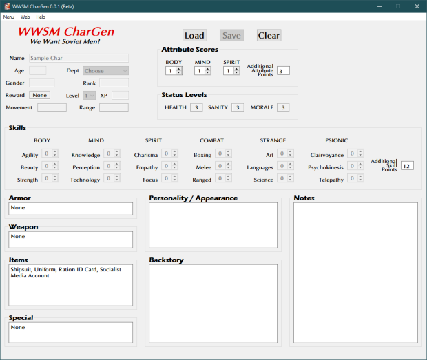

**We Want Soviet Men RPG Character Generator**
==============================================

.. figure:: images/wwsm.png

**We Want Soviet Men RPG Character Generator** is a Windows program for creating characters using the Total Party Skills system.

Notes
-----

**We Want Soviet Men RPG Character Generator** is being developed using Python 3.11.6 and PyQt5.

Requirements
------------

* **Windows 11**

  It will also run in Windows 10.

* **Python 3.11.6**

  This code was written using the C implementation of Python
  version 3.11.6. Also known as CPython.

* **PyQt5 5.15.9**

  PyQt5 is the framework used for displaying the Window GUI and buttons, etc.

* **fpdf2 2.7.5**

  Fpdf2 is needed for printing the character sheets.

Things To-Do
------------

| Continue unifying the skills across all TPS genres.
| Instruction manual.
| Cheat codes.

Known History
-------------

* v0.3.0b

  Compatible with TPS Die Roller 0.5.0.

* v0.2.1b

  Fixed skill and score caps when saving.

* v0.2.0b

  Character PDFs are now saved in **Characters** folder.

* v0.1.1b

  Updated to fpdf2 2.7.5.

  PDF charsheets can now be created in EXE version.

  Updated to Python 3.11.4.

* v0.0.2b

  Psionic check fix during chargen.

* v0.0.1b

  Initial release.

The We Want Soviet Men RPG was written by R. Joshua Holland.
Copyright 2021 - 2022, Total Party Skills.
https://www.drivethrurpg.com/product/373183/Planet-Matriarchy-WE-WANT-SOVIET-MEN

Contact
-------
Questions? Please contact shawndriscoll@hotmail.com
